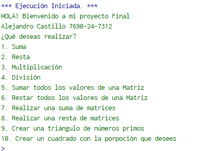
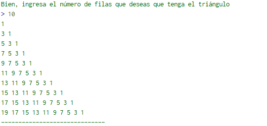
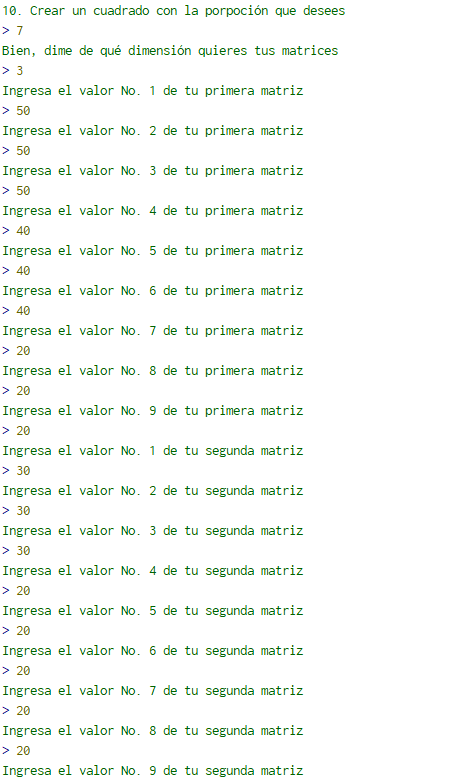
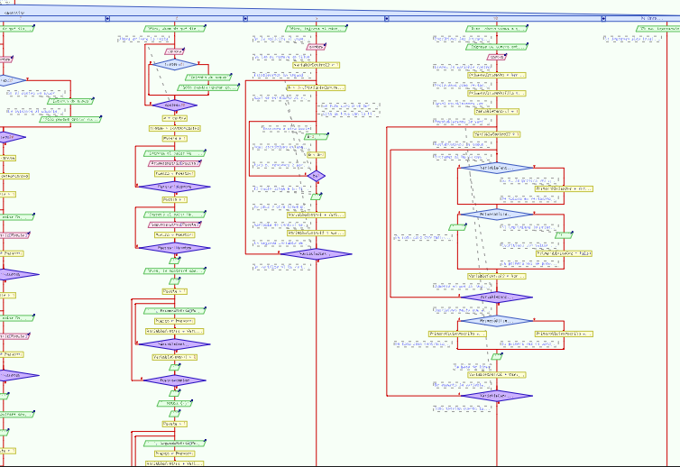
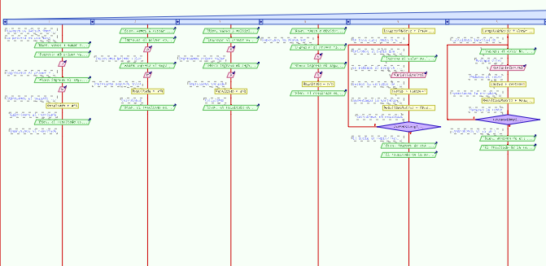
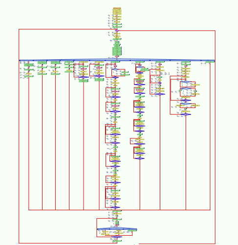
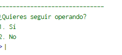
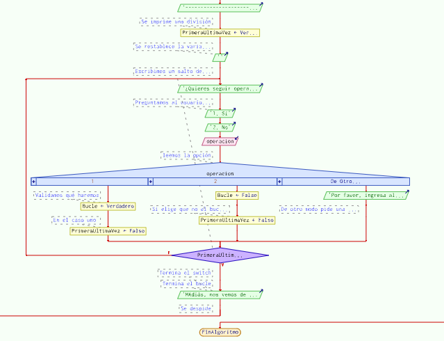

# Calculadora de Pseint
Esta es la documentación de mi código desarrollado en Pseint

Vamos a comenzar viendo las **Funcionalidades** que tiene el código.

A continuación veremos el menú con el que cuenta nuestra calculadora que nos da un total de **10 Funcionalidades diferentes**. Cada una es explicada.

Bien. Podremos elegir cualquiera de las 10 opciones. En este caso elegiremos los últimos dos algoritmos que fueron los mejor estructurados y optimizados.

## Generador de Números Impares
En este caso, al elegir la opción No. 9, podremos ingresar el número de filas deseadas para generar un triángulo ordenado de forma descendente de números impares. Podemos ver un ejemplo a continuación.

Como podemos observar, en este caso ingresamos el número diez, y nos devolvió un triángulo con 10 filas de números impares que incrementan su tamaño en uno conforme avanza el número de filas.

Adjunto Código
~~~Pseint
Escribir "Bien, ingresa el número de filas que deseas que tenga el triángulo" 
				Leer conteo 
				VariableControl2 = 1 
					b = 3 + ((VariableControl2 - 1) * 2) 
					Repetir 
						Escribir Sin Saltar b - 2," " 
						b = b - 2 
					Hasta Que b <= 1 
					Escribir "" 
					VariableControl = VariableControl + 1
					VariableControl2 = VariableControl2 + 1
				Hasta Que VariableControl >= conteo
~~~
## Generador de Cuadrados
Otro algoritmo bastante bonito y bien abordado, es el algoritmo para generar cuadros según la necesidad del usuario.

Adjunto imagen de ejemplo:

En este caso generamos un cuadro de 20x20

## Suma y resta de matrices

Podemos sumar y restar matrices de igual proporción con nuestra calculadora.

Ingresamos la dimendión que queremos para posteriormente ingresar el valor de cada uno de los puestos

Aquí realizamos el ingreso de matrices de 9x9, son algo grandes y tediosas de ingresar, pero para ver de mejor forma la graficación de matrices, se eligió hacer de esta proporción.

### Impresión de matrices y resultado

Una vez ingresamos todos los valores de las dos matrices a sumar o restar, el programa nos despliega las dos matrices ingresadas y su resultado como podemos ver en el siguiente ejemplo.

Al final siempre observamos unas Líneas que dividen el fin de cada **Funcionalidad**

### Diagrama de flujo de funcionalidades

Podemos ver que no son los más grandes, pero sí los mejor optimizados.

---

## Funcionalidades Básicas
Esta calculadora no se queda atrás con las funcionalidades básicas de cualquier otra calculadora. En este caso podemos hacer otras 6 opciones como la suma, resta, multiplicación y división de dos números enteros o reales.

Además de hacer la suma de todos los componentes de una matriz o restar todos los componentes de una matriz.

Diagramas:

Realmente son operaciones tan simples como definir el resultado de dos variables dependiendo la operación a realizar.

## Diagrama de Flujo General

Este código tiene un enorme diagrama de flujo que reta las capacidades de Pseint, se los presento a continuación.

Como podemos observar, la estructura principal es un **Según** que vendría siendo un Switch en cualquier lenguaje de programación. Creo que esa es la estructura más ordenada para este tipo de menús y la mejor vista. Por estas razones decidí realizarlo de esa forma.

## Al Finalizar el Código
Cuando terminas de utilizar las funciones de la calculadora, te pregunta si quieres realizar alguna otra operación para que así el código no te deje vendido cada vez que realizas algo.

Ejemplo: 

En este caso debemos tener tolerancia a fallos, algo que se logra con un bucle y un según qué que determina si la variable que hace que se repita el bucle sea verdadera o falsa dependiendo la elección del usuario.

Diagrama de Flujo:

Como podemos observar, el usuario debe elegir 1 o 2, si elige algo incorrecto, el código se repite hasta que elija algo real.

Así concluyendo mi código. **Muchas Gracias por Leer**

## Video Mostrando Funcionalidades

[Video de Calculadora en Pseint](https://www.youtube.com)

